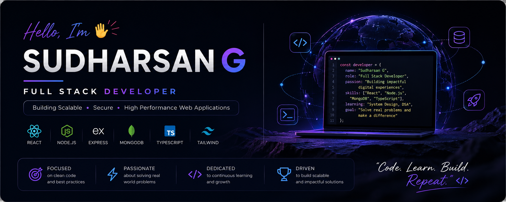

<div align="center">



# Hi... I'm Sudharsan G

### Full Stack Developer • MERN Stack Enthusiast • Backend Focused 


</div>

---

# 💎 About Me

```diff
+ Full Stack Developer focused on scalable applications
+ Interested in Backend Systems & Realtime Architectures
+ Building MERN applications with secure authentication
+ Learning DSA, TypeScript and System Design
```

---

# ⚡ Tech Arsenal

<div align="center">

### Frontend


### Backend


### Tools


</div>

---

# 🚀 Featured Projects

## 💬 Realtime Chat Application

### Features

✔ Realtime Messaging  
✔ Authentication & Authorization  
✔ Private Chats  
✔ Online / Offline Status  
✔ Responsive UI  
✔ Secure APIs  

### Stack

```text
React • Node.js • Express • MongoDB • JWT • Socket.io
```

### Architecture

```text
Client Layer
    ↓
REST APIs
    ↓
Backend Server
    ↓
MongoDB

Socket Server
    ↕
Realtime Communication
```

Demo: https://quickchat-realtime.vercel.app/ 

---

## 🎓 Smart Student Management Platform

### Features

✔ JWT Authentication  
✔ Role Based Access  
✔ CRUD Operations  
✔ Admin Dashboard  
✔ REST APIs  

### Stack

```text
React • Node.js • Express • MongoDB • JWT
```

---

# 📊 GitHub Analytics

<p align="center">


</p>

---

# 🔥 Contribution Streak

<div align="center">


</div>

---

# 📈 Activity Graph


---

# 🏆 Developer Metrics

```text
Projects Built      → 7+
DSA Problems        → 70+
Repositories        → 10+
Technologies Used   → 10+
```

---

# 🌐 Connect With Me

LinkedIn: https://linkedin.com/in/sudharsan2410

Portfolio: https://sudharsan-dev.vercel.app/ 

Email: sudharsanganapathy24@gmail.com  

---

<div align="center">

### "Code • Learn • Build • Repeat "

</div>
