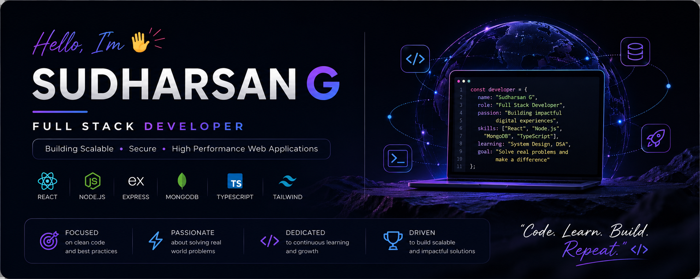

<div align="center">



<br/>

# SUDHARSAN G

### Full Stack Developer · MERN · Backend · Real-Time Systems


<br/>

<a href="https://sudharsan-dev.vercel.app">

</a>
&nbsp;
<a href="https://linkedin.com/in/sudharsan2410">

</a>
&nbsp;
<a href="mailto:sudharsanganapathy24@gmail.com">

</a>
&nbsp;
<a href="https://github.com/sudharsanganapathy">

</a>

<br/><br/>


</div>

---

<div align="center">

## ⚡ I BUILD SYSTEMS, NOT JUST INTERFACES.

</div>

I'm a **Full Stack Developer** focused on building modern web applications with the **MERN stack**, with a strong interest in backend engineering, API architecture and real-time communication.

I enjoy taking an idea from **interface → API → database → deployment** and turning it into a complete working product.

```text
                    ┌─────────────────────────┐
                    │       IDEA / PRODUCT     │
                    └────────────┬────────────┘
                                 │
                                 ▼
                    ┌─────────────────────────┐
                    │      REACT FRONTEND      │
                    └────────────┬────────────┘
                                 │
                         REST / REAL-TIME
                                 │
                                 ▼
                    ┌─────────────────────────┐
                    │    NODE + EXPRESS API    │
                    └────────────┬────────────┘
                                 │
                                 ▼
                    ┌─────────────────────────┐
                    │   MONGODB / MONGOOSE     │
                    └────────────┬────────────┘
                                 │
                                 ▼
                    ┌─────────────────────────┐
                    │       DEPLOYMENT         │
                    └─────────────────────────┘
```

---

# 🧠 ENGINEERING FOCUS

<div align="center">

<table>
<tr>
<td width="33%" align="center">

### ⚡ FULL STACK

React.js
JavaScript
Tailwind CSS
Vite
Responsive UI

</td>

<td width="33%" align="center">

### 🔥 BACKEND

Node.js
Express.js
REST APIs
Authentication
Authorization

</td>

<td width="33%" align="center">

### 🌐 REAL-TIME

Socket.io
WebSocket Communication
Online Presence
Real-Time Events
Private Messaging

</td>
</tr>
</table>

</div>

---

# 🛠️ TECH ARSENAL

<div align="center">

### Frontend


<br/><br/>

### Backend & Database


<br/><br/>

### Tools & Deployment


<br/><br/>

### Exploring Next


</div>

---

# 🚀 FLAGSHIP PROJECTS

## 💬 QUICKCHAT

### Real-Time Communication Platform

> A full-stack messaging application engineered around REST APIs and real-time WebSocket communication.

<br/>

### 🔥 What It Does

```text
┌────────────────────────────────────────────────────┐
│                     QUICKCHAT                      │
├────────────────────────────────────────────────────┤
│                                                    │
│  🔐 Authentication       JWT + bcrypt              │
│  💬 Messaging            Real-time communication   │
│  🟢 Presence             Online / Offline status   │
│  👤 Conversations        Private messaging         │
│  🖼️ Media                Cloudinary integration     │
│  🛡️ APIs                 Protected REST endpoints  │
│  📱 UI                   Responsive React app      │
│                                                    │
└────────────────────────────────────────────────────┘
```

### 🏗️ Architecture

```text
                         ┌───────────────┐
                         │ React Client  │
                         └───────┬───────┘
                                 │
                   ┌─────────────┴─────────────┐
                   │                           │
                REST API                  Socket.io
                   │                           │
                   ▼                           ▼
          ┌────────────────┐          ┌────────────────┐
          │ Express Server │          │ Socket Server  │
          └───────┬────────┘          └────────────────┘
                  │
                  ▼
          ┌────────────────┐
          │    MongoDB     │
          │   + Mongoose   │
          └────────────────┘
```

### 🧩 Stack

`React` · `Node.js` · `Express` · `MongoDB` · `Mongoose` · `JWT` · `Socket.io` · `Cloudinary` · `Tailwind CSS`

<div align="center">

<a href="https://quickchat-realtime.vercel.app/">

</a>

</div>

---

## ✈️ AEROVISTA

### Flight Management System

> A full-stack flight management platform designed around authentication, flight operations, bookings and role-based administration.

### 🔐 Core Engineering

```text
Authentication
      │
      ▼
JWT Verification
      │
      ▼
Role-Based Middleware
      │
 ┌────┴────┐
 ▼         ▼
USER      ADMIN
 │          │
 ▼          ▼
Flights    Manage Flights
Bookings   Manage Bookings
Profile    Admin Operations
      │
      ▼
   MongoDB
```

### ✨ Features

* ✈️ Flight management
* 🎫 Booking workflow
* 🔐 JWT authentication
* 👥 Role-based access
* 🛡️ Protected APIs
* 📊 Admin operations
* 🗄️ MongoDB persistence
* 📱 Responsive React interface

### 🧩 Stack

`React` · `Node.js` · `Express` · `MongoDB` · `Mongoose` · `JWT` · `Tailwind CSS` · `Vite`

---

## 🍽️ PUSHPAVALLI KITCHEN

### Premium Restaurant Web Experience

> A modern restaurant website focused on premium visual design, smooth interactions and responsive user experience.

### ✨ Built With

`React` · `Tailwind CSS` · `GSAP` · `Framer Motion` · `React Router` · `Vite`

### 🎨 Focus

```text
Premium UI
   ↓
Micro Interactions
   ↓
Smooth Animations
   ↓
Responsive Design
   ↓
Modern User Experience
```

---

# 🧩 HOW I THINK ABOUT DEVELOPMENT

```text
                 PROBLEM
                    │
                    ▼
              Understand
                    │
                    ▼
                Design
                    │
                    ▼
               Implement
                    │
                    ▼
                 Test
                    │
                    ▼
               Optimize
                    │
                    ▼
                Deploy
```

### My development priorities

```text
01 → Clean & maintainable code
02 → Secure authentication
03 → Scalable API structure
04 → Good database design
05 → Responsive user experience
06 → Performance awareness
07 → Continuous improvement
```

---

# 🔐 BACKEND ENGINEERING

<div align="center">

| Concept        | What I Work With                 |
| :------------- | :------------------------------- |
| Authentication | JWT, bcrypt                      |
| Authorization  | Role-Based Access                |
| APIs           | REST Architecture                |
| Middleware     | Auth, Validation, Error Handling |
| Database       | MongoDB, Mongoose, SQL           |
| Real-Time      | Socket.io                        |
| Media          | Cloudinary                       |
| Testing        | Postman                          |
| Deployment     | Render, Vercel                   |

</div>

---

# 🧠 DSA & PROBLEM SOLVING

I practice **Data Structures & Algorithms** to improve problem-solving ability and prepare for real-world engineering challenges and technical interviews.

### Patterns I'm practicing

```text
Arrays
Strings
Hashing
Two Pointers
Sliding Window
Binary Search
Sorting
Recursion
Linked Lists
Stacks & Queues
Trees
JavaScript Problem Solving
```

### Current approach

```text
Solve
  ↓
Understand the Pattern
  ↓
Analyze Time Complexity
  ↓
Analyze Space Complexity
  ↓
Optimize
  ↓
Implement Again
```

---

# 📚 CURRENTLY BUILDING MY NEXT LEVEL

<div align="center">

<table>
<tr>
<td align="center" width="33%">

### 🟦 TypeScript

Writing safer and more maintainable applications.

</td>

<td align="center" width="33%">

### 🧠 DSA

Strengthening algorithmic thinking and problem solving.

</td>

<td align="center" width="33%">

### 🏗️ System Design

Learning how scalable systems are structured.

</td>
</tr>
</table>

</div>

---

# 📊 GITHUB ANALYTICS

<div align="center">


</div>

---

# 🔥 CONTRIBUTION STREAK

<div align="center">


</div>

---

# 🏆 GITHUB TROPHIES

<div align="center">


</div>

---

# 📈 CONTRIBUTION ACTIVITY


---

# 📌 DEVELOPER SNAPSHOT

<div align="center">

|                          |                          |
| :----------------------: | :----------------------: |
|      🚀 **Projects**     |          **7+**          |
|    🧠 **DSA Problems**   |          **70+**         |
|    📦 **Repositories**   |          **10+**         |
|    ⚙️ **Technologies**   |          **10+**         |
|   💻 **Primary Stack**   |         **MERN**         |
| 🔥 **Engineering Focus** | **Backend + Full Stack** |

</div>

---

# 🌐 LET'S CONNECT

<div align="center">

<a href="https://sudharsan-dev.vercel.app">

</a>

<br/><br/>

<a href="https://linkedin.com/in/sudharsan2410">

</a>

<a href="mailto:sudharsanganapathy24@gmail.com">

</a>

<br/><br/>

<a href="https://github.com/sudharsanganapathy">

</a>

</div>

---

<div align="center">

<br/>

## BUILD. BREAK. LEARN. REBUILD. 🚀

### Turning ideas into working software, one commit at a time.

<br/>


</div>
